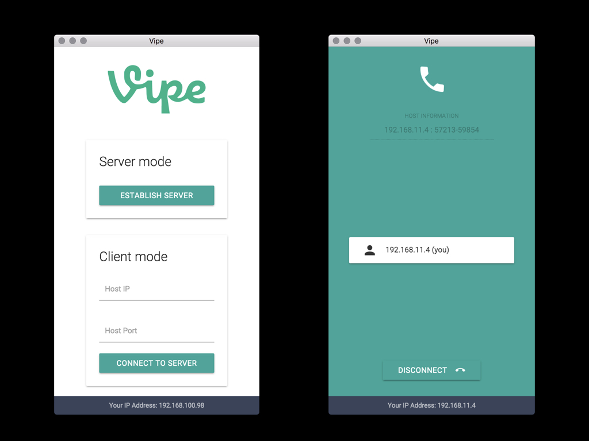

# Vipe

クライアント・サーバーモデルのVoIPサービス。
サーバーはユーザー自身が設置することができる。



## Technologies

### Frontend

- Electron
- React
- styled-components
- react-materialize

## build

```
$ npm -g install electron
$ npm -g install electron-packager
$ yarn
$ npm build # for mac
$ npm build-for-linux
```
